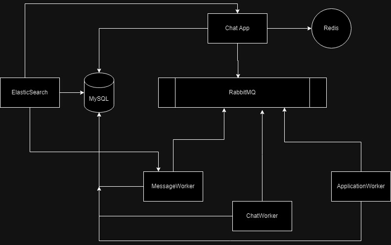

# Chat Application System
## Approach
To achieve the purpose of the task, I used the following technologies.
 - I used MySQL for saving of the records of applications, chats and messages.
 - I used ElasticSearch and its integration with rails to achieve the partial searching in the messages of each chat per application. This is done by indexing the database with ElasticSearch upon writing in the database.
 - I used RabbitMQ to facilitate the asynchronous adding of messages and chats.
 - I used Redis, to help in generating the chat numbers and the messages numbers.

## Design


The design is as follows:
- We have the chat application as a ruby on rails service with models for application, chat and messages.
- We have redis that is used to generate and keep track of messages and chats numbers.
- We have RabbitMQ queue.
- We have controllers for them all. These controllers use RabbitMQ as a queue to asynchrously write in the database, by pushing updates to the queue.
- We have elastic search as a separate service that gets indexed whenever there is a new message update.
- We have 3 workers, that are sneaker workers that listen on RabbitMQ to update the database asynchronously based on any changes.

## How to run
Run the following command to build and run the application

    docker compose up --build
The `--build` argument is to rebuild the chat app before deploying. If you already built it, then you can

    docker compose up

## APIs and How to test them

 - Add an application and get token
```
curl -X POST   http://localhost:3000/applications   -H 'Content-Type: application/json'   -d '{
    "name": "Samplpp"
  }'
  ```

- Add chat to application
```
curl -X POST   http://localhost:3000/applications/:token/chats   -H 'Content-Type: application/json' -d '{
    "name": "chat"
  }'
```

- Get total chats in an application
```
curl -X GET "http://localhost:3000/applications/:token/total_chats"
```

- Add message to a chat in an application
```
curl -X POST -H "Content-Type: application/json" -d '{"body":"Hello, World!"}' http://localhost:3000/applications/:token/chats/:chat_number/messages
```

- Search/partial search for message in a chat in an application
```
curl -X GET 'http://localhost:3000/applications/:token/chats/:chat_number/messages/search?query=Hello'
```

- Get all applications
```
 curl "http://localhost:3000/applications"
```

- Get all chats for a specific application
```
curl "http://localhost:3000/applications/:token/chats"
```

- Get all messages for a chat in a specific application
```
curl "http://localhost:3000/applications/:token/chats/:chat_number/messages"
```

- Update an application
```
curl -X PUT   http://localhost:3000/applications/:token -H 'Content-Type: application/json'   -d '{
    "application": {
      "name": "New Application Name"
    }
  }'
```

- Update a chat
```
curl -X PUT  http://localhost:3000/applications/:token/chats/:chat_number   -H 'Content-Type: application/json' -d '{
    "name": "newchatname"
  }'
```

- Update a message
```
curl -X PUT -H "Content-Type: application/json" -d '{"body":"modified"}' http://localhost:3000/applications/:token/chats/:chat_id/messages/:message_number
```

- Delete an application and all its chats and messages
```
url -X DELETE http://localhost:3000/applications/:token -H "Content-Type: application/json"
```

- Delete a chat and all its messages
```
curl -X DELETE http://localhost:3000/applications/:token/chats/:chat_number
```

- Delete a message
```
curl -X DELETE -H "Content-Type: application/json" http://localhost:3000/applications/:token/chats/:chat_number/messages/:message_number
```
## How to clean
It is recommended to clean after every re run.

    ./clean.sh
